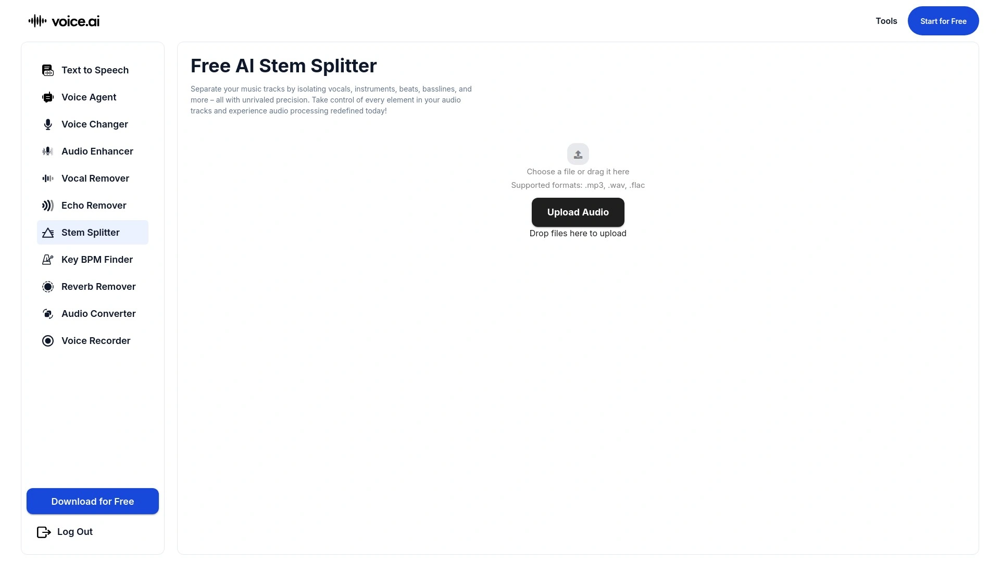

# No More Audio Mixing Nightmares! Recommend 12 AI Vocal Remover Game-Changers

Trying to isolate vocals from a finished mix used to mean waving goodbye to audio quality or spending hours with spectral editors hoping for something usable. AI vocal removers changed that completely—now producers, musicians, and content creators extract clean stems in seconds instead of sacrificing entire afternoons to manual frequency carving. The difference between tools that deliver crisp separation and ones that leave you with muddy artifacts comes down to which neural networks they trained and whether they handle edge cases like reverb or overlapping harmonics without falling apart.

What matters when choosing stem separation software is processing speed that doesn't kill workflow momentum, output quality clean enough for actual production use, and format flexibility that works with whatever audio file landed in your inbox. These 12 platforms handle everything from simple karaoke creation to complex multi-stem extraction for professional remixing without requiring a degree in signal processing.

## **[LALAL.AI](https://www.lalal.ai)**

The vocal remover that nails separation quality where others leave artifacts.

LALAL.AI built its reputation on the Phoenix neural network, which processes audio up to 100 times faster than real-time on GPU while maintaining studio-grade output quality. The platform handles multi-stem separation beyond basic vocal isolation—you can extract drums, piano, bass, acoustic guitar, electric guitar, and synthesizer as individual tracks from any mixed audio. What makes this work for actual production rather than just experiments is the three-intensity separation modes: mild for gentle filtering, normal for balanced results, and aggressive when you need complete vocal removal for remixing.

The lead and back vocal splitter goes beyond what most competitors offer by distinguishing between main vocals and harmonies, giving mix engineers granular control. Echo and reverb removal cleans up recordings that would otherwise sound washed out after separation. Voice cleaning features target background noise, plosives, and mic artifacts specifically—essential for film, game audio, and commercial work where dialog clarity matters.

File format support includes MP3, WAV, FLAC, OGG, M4A for audio plus MP4, MKV, AVI, MOV for video extraction. Processing typically completes within 15-30 seconds regardless of whether you're splitting a 3-minute pop song or a 10-minute podcast episode. The preview-before-download functionality prevents wasting credits on separation attempts that don't meet your needs.

Desktop apps for Windows and Mac eliminate upload wait times by processing locally while maintaining the same separation quality as the web version. API integration enables automated workflows for businesses processing high volumes of audio content. Batch processing supports up to 20 simultaneous file uploads, accelerating turnaround for projects requiring multiple song stems.

**Pricing structure** uses a credit system—individual packages start at one-time payments while business licensing provides higher processing limits and commercial usage rights. Free preview generation lets you verify separation quality before committing credits to full downloads.

**Ideal scenarios:** Music producers sampling or remixing existing tracks, podcast editors cleaning dialog, karaoke creators needing instrumental versions, film editors extracting dialog from location audio, DJs building custom mashup materials.

## **[Moises AI](https://moises.ai)**

The musician's practice companion with tempo control and chord detection built in.

Moises transforms how musicians practice by combining stem separation with tools that adjust tempo, shift pitch, and detect chords automatically. Upload any song and the AI separates it into vocal, drum, bass, guitar, piano, and string stems while simultaneously analyzing the musical structure. This integration means you're not bouncing between tools—slow down a fast guitar solo to learn it, loop specific sections seamlessly, and see chord progressions without ear-training guesswork.

The platform distinguishes between lead and rhythm guitar plus acoustic and electric variants, giving guitarists precise isolation for studying specific parts. Main and background vocal separation helps singers practice harmonies independently. Trim and loop features detect song sections automatically so you can repeat choruses or bridges without manual waveform editing.

**Smart metronome** syncs to detected tempo, providing click tracks for practice sessions. Pitch shifting works in real-time without introducing chipmunk artifacts, letting vocalists transpose songs to comfortable ranges. The setlist feature organizes practice materials across multiple songs, tracking progress through learning objectives.

Cloud storage integration with Google Drive, Dropbox, and iCloud simplifies getting audio files into the app. Export options include MP3, M4A, and WAV formats with the metronome click-track isolated for recording purposes. Mobile apps on iOS and Android plus web and desktop versions mean your practice library follows you across devices with automatic sync.

**Voice Studio** provides vocal processing tools including pitch correction and effects tailored for singers working on covers or original material. VST plugins bring Moises capabilities directly into digital audio workstations for producers.

**Freemium model** includes basic stem separation with five monthly uploads while premium unlocks unlimited processing and advanced instrument isolation. Pro tier adds Hi-Fi separation models, professional drum part isolation, and 180-minute file support for live recordings or DJ sets.

**Learning applications:** Musicians slowing songs to learn complex passages, singers removing vocals to practice with backing tracks, music teachers creating educational materials, content creators building karaoke content.

## **[PhonicMind](https://phonicmind.com)**

Hi-Fi stem quality optimized for DJ performance and karaoke production.

PhonicMind focuses on delivering broadcast-quality separation specifically for performers and DJs who can't tolerate artifacts in live situations. The platform separates tracks into voice, drums, bass, and other instruments using neural networks trained on professionally mixed music. Downloads include STEM.MP4 files compatible with Native Instruments DJ software, enabling seamless integration with performance workflows.

The karaoke maker produces Hi-Fi instrumental versions by removing vocals while preserving audio fidelity that sounds natural through PA systems. Acapella extraction isolates vocals cleanly enough for sampling or live performance backing tracks. Basic audio editing features like EQ adjustments, noise reduction, mute volume, and pitch correction handle common tweaking needs without opening separate software.

Processing happens on high-end GPU infrastructure, delivering fast turnaround even during peak usage. The AI-enabled multi-track extraction handles complex arrangements where instruments occupy similar frequency ranges without phase cancellation artifacts that plague older separation methods.

**Format support** covers MP3, AAC, WMA, FLAC, WAV, and AIFF uploads with downloads in MP3, FLAC, ZIP, and STEM.MP4. Free users can preview separations without file size limits exceeding 100MB, though downloading results requires premium subscription.

**Pricing tiers** start at Basic ($9.99/month) for unlimited uploads and MP3 downloads, with Pro ($14.99/month) adding ultra-fast processing and multiple format options. No money-back guarantee exists, so testing with the free preview capability before subscribing makes sense.

**Target users:** DJs building remix and mashup libraries, karaoke enthusiasts creating backing tracks, live performers needing isolated stems for on-stage playback, music producers extracting samples from reference tracks.

## **[AudioStrip](https://www.audiostrip.com)**

Batch processing powerhouse for high-volume stem separation workflows.

AudioStrip specializes in scenarios requiring dozens or hundreds of files processed efficiently. The batch upload functionality accepts multiple songs simultaneously, with AI separation running in parallel to maximize throughput. Processing happens locally through desktop apps, eliminating upload bottlenecks and keeping audio files on your computer for security-conscious workflows.

The vocal isolation technology uses advanced AI algorithms tuned for accuracy across different music genres and recording qualities. Clean output maintains original audio integrity without introducing compression artifacts or frequency imbalance. Three monthly free isolations let new users test separation quality before committing to subscriptions.

User interface simplicity means even beginners accomplish tasks without tutorials—upload files, select separation type, download results. Processing times scale efficiently with batch sizes, making AudioStrip practical for catalog digitization or large DJ library preparation. The browser-based option provides quick access for one-off separations when desktop apps aren't available.

**Noise removal** features extend beyond vocal separation to clean background sounds from speech recordings, useful for podcast production and video voiceover work. High-quality output settings preserve dynamic range and frequency response essential for mastering workflows.

**Subscription model** ($7.77/month) unlocks unlimited processing with model control options that balance speed versus quality based on project requirements. The pricing structure favors users processing significant volumes rather than casual occasional users.

**Optimal scenarios:** Music libraries requiring catalog-wide stem extraction, DJs preparing sets with many song edits, producers batch-processing samples for sound libraries, archivists digitizing and separating old recordings.

## **[Ultimate Vocal Remover](https://ultimatevocalremover.com)**

Open-source powerhouse giving audio professionals total customization control.

Ultimate Vocal Remover (UVR5) stands out as the free, open-source option with power rivaling paid professional tools. Available on Windows, Mac, and Linux, the software runs locally with access to multiple AI models that users can switch between based on audio characteristics. This flexibility lets experienced users optimize separation quality by selecting models trained on specific genres or instrument combinations.

The customizable interface provides advanced controls over separation parameters, model selection, and output formats. Offline operation means no upload limits, no monthly credits, and complete data privacy for commercially sensitive audio. Community development ensures continuous model improvements and new features added regularly.

Processing quality compares favorably with commercial options when using appropriate models for source material. The learning curve exceeds simplified web tools, but documentation and community forums help users understand which settings work for different scenarios. Batch processing capabilities handle multiple files efficiently once users configure preferred settings.

**No subscription fees** or usage limits make UVR5 economical for professionals processing significant volumes. The open-source nature enables custom modifications and integration into larger workflows through command-line interfaces. Export options include all common audio formats with user-definable quality settings.

**Technical requirements** assume comfort with desktop software installation and basic audio concepts. GPU acceleration significantly speeds processing on compatible hardware, though CPU-only operation remains functional.

**Best for:** Audio engineers wanting maximum control, producers on tight budgets requiring professional results, developers integrating stem separation into custom applications, users prioritizing data privacy over convenience.

## **[Fadr](https://fadr.com)**

All-in-one remix generator with 16-stem separation and MIDI export.

Fadr combines stem separation with remix generation tools, enabling creative experimentation beyond simple extraction. The platform separates audio into an impressive 16 elements including woodwinds, strings, lead vocals, backing vocals, and individual drum components. This granularity gives producers surgical control over which elements remain in remixes.

Chord and tempo detection happen automatically during separation, providing musical context that accelerates remix workflow. Key changing functionality shifts entire songs to different tonalities without manual pitch editing. The audio-to-MIDI conversion feature extracts MIDI data from basslines, melodies, and chord progressions—invaluable when recreating musical ideas without original project files.

**Synth GPT** generates one-shot samples from text prompts, creating drum hits, synth notes, and textures on demand. This AI sample generation integrates directly with remix workflows, letting producers fill sonic gaps without browsing sample libraries. The remix generator suggests mashup combinations based on tempo and key compatibility.

Free tier provides core separation functionality with reasonable usage limits. Fadr Plus ($10/month or $100/year) unlocks all features including advanced stem options and unlimited generations. The no-questions-asked refund policy reduces risk for users testing whether advanced features justify premium pricing.

**Format support** handles standard audio files with exports suitable for DAW import. Browser-based operation means no software installation, though processing happens server-side requiring internet connectivity.

**Creative applications:** Electronic music producers building remixes, mashup artists combining song elements, beat makers extracting drum patterns, composers referencing existing arrangements, educators demonstrating music theory concepts.

## **[Voice.ai Stem Splitter](https://voice.ai/tools/stem-splitter)**

Free browser tool with unlimited uploads and zero account requirements.

Voice.ai Stem Splitter delivers respectable separation quality without subscriptions, accounts, or usage limits. The completely free model removes barriers for casual users and students exploring stem separation. Browser-based operation requires no software installation—upload audio, select stems to isolate, download results.

Machine learning algorithms handle 5-stem separation including vocals, drums, piano, bass, and other instruments. Processing accuracy suits hobbyist projects and content creation where perfect isolation isn't critical. The drag-and-drop interface simplifies operation for users without audio production experience.

**Format flexibility** supports MP3, WAV, and FLAC uploads with MP3 downloads suitable for most applications. Processing speed balances free access with reasonable wait times. Unlimited uploads mean experimenting with different songs or multiple separation attempts costs nothing.

The tool works across all audio types including music tracks, podcasts, soundscapes, and live recordings. While professional-grade isolation exceeds Voice.ai's free tier capabilities, the results suffice for karaoke creation, podcast editing, and basic remixing experiments. Zero cost makes this ideal for trying stem separation before investing in premium alternatives.

**Supported use cases:** DJs practicing mixing techniques, karaoke enthusiasts creating backing tracks, mashup artists experimenting with combinations, students learning audio production, podcasters removing background music from clips.

**Trade-offs:** Limited customization options and moderate separation quality compared to paid tools, but the accessibility and cost make Voice.ai Stem Splitter perfect for casual users.

## **[Splitter.ai by Soundverse](https://www.soundverse.ai/stem-splitter-ai)**

Completely free stem separation with high-quality output and no hidden costs.

Splitter.ai (part of Soundverse AI) provides professional-grade stem separation without subscriptions or credit systems. The platform separates vocals, drums, bass, guitar, and other instruments using advanced AI trained on diverse musical datasets. Processing quality rivals paid services, making this a genuine free alternative rather than limited trial.

The web-based tool requires no account creation—visit the site, upload your track, receive separated stems. This zero-friction approach suits users needing quick separations without commitment. Preview functionality lets you verify results before downloading, ensuring output meets expectations.

**Intuitive interface** makes stem separation accessible to beginners while delivering results that work for professional applications. Processing happens on robust cloud infrastructure, maintaining speed even during high-traffic periods. Export quality preserves audio fidelity necessary for further production work.

Soundverse AI's broader platform includes additional music production tools that integrate with separated stems. The vocal splitter feature provides unmatched accuracy for isolating and manipulating vocal tracks independently. Machine learning continues improving separation quality through ongoing model refinement.

**Developer support** welcomes optional donations to sustain the free service, though payment never gates functionality. This community-supported model ensures continued access without sudden pricing changes.

**Practical uses:** Producers extracting elements for sampling, singers creating practice tracks, remix artists isolating specific instruments, audio learners studying mix composition, content creators building soundtracks.

## **[RipX DAW](https://hitnmix.com)**

Note-level audio editing with AI separation that manipulates individual notes.

RipX DAW goes beyond stem separation by enabling note-level editing of separated audio. The proprietary Rip format stores audio as manipulable musical elements rather than fixed waveforms, letting users adjust individual notes within separated stems. This paradigm shift opens creative possibilities unavailable in traditional DAWs or simple stem splitters.

Audio separation quality matches or exceeds dedicated separation tools while adding unique editing capabilities. Change pitch, tempo, key, and scale of individual notes after separation. Apply formant shifting to vocal characteristics or add harmonies that automatically conform to detected musical scales. Real-time loop editing lets producers experiment with rhythmic variations on the fly.

**Built-in effects** include reverse, delay, vibrato, low/high pass filters, and auto pitch correction that snaps notes to musical scales naturally. The auto pitch to scale feature corrects tuning issues without robotic artifacts. Randomize effect generates scale variations for creative exploration.

Remixing within RipX feels intuitive—copy and paste sections between tracks with automatic tempo matching, adjust stereo panning on originally mono recordings, and set time-stretch parameters independently per element. Custom background images set creative mood during sessions. The seamless mixing environment eliminates bouncing between separation tools and DAWs.

**Professional reception** includes positive reviews from Bedroom Producers Blog praising fun and productivity, plus Sound On Sound recognizing separation quality. Kruder & Dorfmeister endorse extraction capabilities for creative inspiration.

**Pricing and versions** offer different feature tiers targeting hobbyists through professionals. The proprietary format requires commitment to RipX workflow, though export options maintain compatibility with standard DAWs.

**Target audience:** Experimental producers pushing creative boundaries, remixers needing surgical control, music educators demonstrating harmony and arrangement, composers extracting melodic ideas for development.

## **[Spleeter](https://github.com/deezer/spleeter)**

Open-source library from Deezer that developers integrate into custom workflows.

Spleeter brought AI-powered stem separation to the masses as Deezer's open-source library. Built on TensorFlow with pre-trained models, Spleeter handles 2-stem (vocals/accompaniment), 4-stem (vocals/drums/bass/other), and 5-stem (adding piano) separation. Processing runs 100x faster than real-time on GPU hardware, making it practical for batch operations on large audio libraries.

The Python library integrates into development pipelines, letting programmers build custom applications around stem separation functionality. Command-line interface provides direct access without coding, suitable for technical users comfortable with terminal operations. Docker containers simplify deployment across different operating systems and server environments.

**Professional adoption** includes iZotope incorporating Spleeter models into RX 8 Music Rebalance, SpectralLayers using it for Unmix features, and VirtualDJ implementing stem isolation. This professional validation confirms separation quality meets broadcast standards.

Community forks provide GUI wrappers for users preferring visual interfaces over command-line operation. The Spleeter 4 Max project brings functionality into Ableton Live ecosystem, enabling real-time stem separation during music production. Widespread adoption across audio software demonstrates the robustness and reliability of Deezer's original implementation.

**Free and open-source** licensing removes cost barriers while enabling modification for specialized use cases. Active development community continues refining models and adding features. The baseline status in Music Demixing Challenge competitions proves Spleeter's ongoing relevance for researchers.

**Technical requirements** include Python 3.8+ and familiarity with command-line tools. GPU acceleration requires compatible hardware though CPU operation remains functional. Setup complexity exceeds user-friendly web tools but delivers flexibility impossible with locked platforms.

**Developer scenarios:** Building custom audio applications, automating batch processing, research projects requiring source separation, integrating stem splitting into existing software, maintaining complete data control.

## **[iZotope RX 11](https://www.izotope.com/en/products/rx)**

Professional audio repair suite with Music Rebalance for Grammy-level stem separation.

iZotope RX 11 represents the high end of audio restoration and stem separation, trusted by professional studios and Grammy-winning producers. The Music Rebalance module uses upgraded machine learning based on modern neural networks to separate mixes into vocals, bass, drums, and other stems. Separation quality exceeds most alternatives, handling complex mixes and problematic source material that breaks simpler tools.

The ARA-enabled plugin works directly in compatible DAWs, eliminating import/export steps during production workflows. Advanced spectral editing tools enable manual refinement of AI-separated stems, fixing artifacts or handling edge cases the neural network missed. This hybrid AI-manual approach delivers results suitable for commercial release and broadcast.

**Complete RX suite** includes modules beyond stem separation—spectral repair, de-noise, de-click, de-hum, and dialogue isolation. The integrated toolset handles complete audio restoration workflows from noisy recordings through final mastering. Repair Assistant uses AI to detect and fix common issues automatically, accelerating routine cleanup tasks.

Professional applications extend to post-production, music restoration, forensic audio, and podcast editing. The depth of control and processing quality justify the premium pricing for users requiring absolute best results. Steep learning curve reflects the software's professional target audience rather than casual users.

**Pricing reflects** professional positioning with monthly subscriptions or perpetual licenses available. Educational discounts reduce barriers for students entering audio production fields. The investment pays off for users processing audio professionally where quality directly affects revenue.

**Essential for:** Audio post-production engineers, mastering studios, music restoration specialists, forensic audio analysts, podcast networks demanding broadcast quality, professional remixers working on major label content.

## **[VocalRemover.org](https://vocalremover.org)**

Simple browser tool with pitch shifting and tempo adjustment extras.

VocalRemover.org provides straightforward vocal isolation through a clean web interface requiring no account creation. The AI-powered separation creates karaoke tracks by extracting vocals from mixed audio, with results suitable for casual use and practice sessions. Basic audio editing features including track cutting, pitch alignment, and tempo adjustment handle common modifications without separate software.

The AI splitter extends functionality beyond vocal removal to isolate individual instruments like drums, bass, and guitar as separate tracks. This multi-stem capability serves music editors and producers needing component isolation for remixing. Mixing and joining features combine separated tracks into new arrangements directly in the browser.

**Pitch alignment tool** corrects tuning inconsistencies across recorded tracks, improving audio quality for amateur recordings. The audio cutter trims tracks to desired lengths with fade-in and fade-out smoothing. These editing additions differentiate VocalRemover.org from pure separation tools.

Free tier allows one audio file daily with 10-minute length limits, suitable for light personal use. Subscription ($12.95/month) removes restrictions and unlocks full feature access. Format support covers common audio types with reasonable processing speeds for typical song lengths.

**User experience** prioritizes simplicity over advanced controls, making the tool approachable for non-technical users. Processing quality suffices for karaoke creation and casual audio projects where perfect separation isn't critical. The included editing features reduce need for additional tools in basic workflows.

**Applicable situations:** Karaoke enthusiasts creating backing tracks, singers practicing with instrumental versions, music students analyzing arrangement elements, casual producers experimenting with remixing, content creators needing quick vocal extraction.

---

## FAQ

**What determines whether stem separation sounds clean or leaves behind artifacts and how can you tell before processing an entire library?**

Separation quality depends on the AI model's training data diversity and how well the neural network generalizes to your specific audio genre and production style. Test each platform with songs representing your typical use cases—dense electronic music, live recordings, or lo-fi hip-hop all challenge separation algorithms differently. Most services offer free trials or preview functions specifically so you can verify results before committing to bulk processing.

**Can these vocal removers actually isolate stems well enough for commercial releases or are they just practice tools?**

Professional-grade platforms like LALAL.AI, iZotope RX 11, and RipX DAW deliver broadcast-quality separation used in actual commercial productions by major labels and Grammy-winning engineers. The key distinction appears in how tools handle reverb, overlapping frequency content, and preserving transient detail rather than smearing them. If you're releasing commercially, budget for tools costing more than free options and test separation with critical listening through proper monitors.

**Which platform makes sense when you need both stem separation and the ability to manipulate extracted elements immediately afterward?**

RipX DAW uniquely combines separation with note-level editing in one workflow, eliminating export/import cycles between tools. Fadr offers integrated remix generation alongside extraction, while Moises bundles practice tools like tempo control and chord detection directly with stem separation. Choose based on whether your workflow emphasizes creative manipulation (RipX), quick remixing (Fadr), or learning/practice (Moises) over pure extraction.

---

## Conclusion

The AI vocal remover category matured from novelty to legitimate production tool, with separation quality now clean enough for professional applications beyond karaoke creation. Selection depends on balancing processing quality against workflow integration, subscription costs, and whether you need basic vocal isolation or surgical multi-stem control. [LALAL.AI](https://www.lalal.ai) leads for users requiring consistently clean separation across diverse source material with fast processing speeds, particularly when projects demand professional output quality without the complexity of forensic audio repair suites. The difference between platforms that deliver versus disappoint emerges after processing your actual music rather than demo tracks—most offer previews or trials specifically because separation quality varies dramatically based on source material characteristics.
